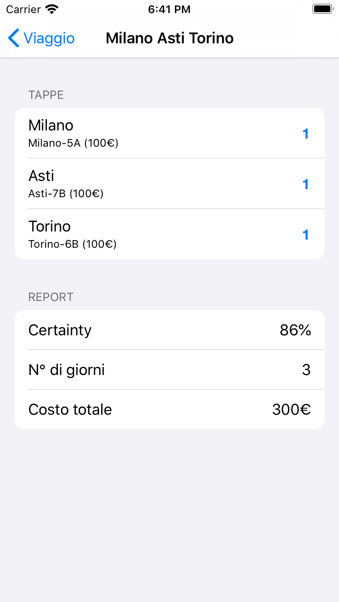

# CLIPS expert system and iOS UI

`./Rules` contains the clips files of a travel-agency project

`./TRAGEX` contains the user interface of the expert system, written in Swift and Objective-C (iOS)

`CLIPS.pdf` report of the project

  
